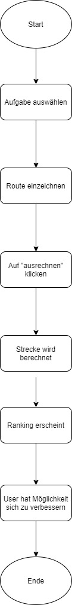
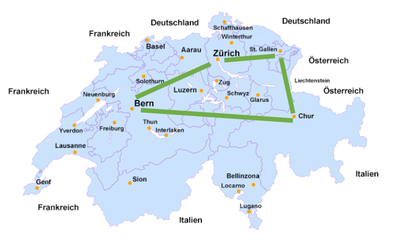
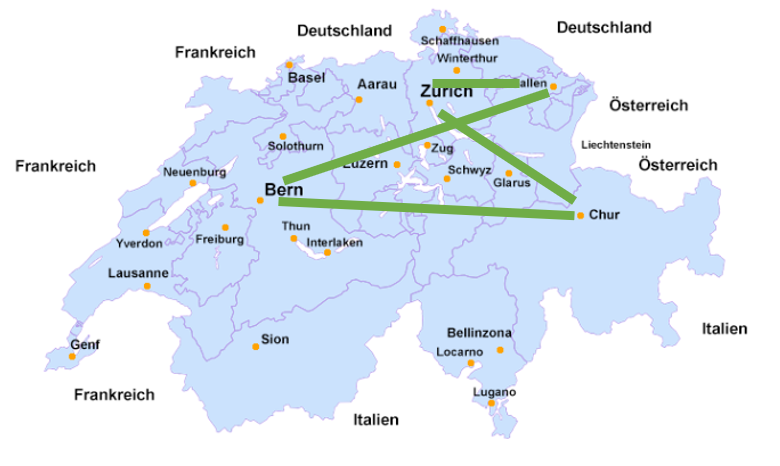

**Ausgangslage**  
Die Web-App soll für den Operations Research Unterricht an der FHS St.Gallen als anschauliches und interaktives Beispiel dienen, das den Studierenden die Traveling-Salesman-Aufgabenstellung näherbringt. Des Weiteren soll die Web-App so weit ausgeklügelt sein, dass sie auf der Website des Instituts für Modellbildung und Simulation eingebettet werden kann.

**Funktion/Projektidee**   
Dem User wird eine Aufgabe vorgegeben. Beispielsweise: «Verbinden Sie alle Schweizer Hauptstädte so, wie Sie das Gefühl haben, dass die Strecke am kürzesten ist.» Die Städte werden auf der Karte vorgegeben. Sobald der Benutzer eine gültige Tour “zusammengeklickt” hat, erscheint die Länge der ganzen Tour. Anschliessend erscheint in der High-Score-Liste die Anzahl Kilometer sowie die erzielte Platzierung.

**Workflow**  
**Dateneingabe**  
Die Dateneingabe erfolgt durch den User, in dem er seinen Namen und die Anzahl Kilometer in ein Form eingibt. 

**Datenverarbeitung/Speicherung**  
Die eingegebenen Daten des User werden in einem Json-File gespeichert. Für das Diagramm werden die Daten vom Json-File in einem Pandas gespeichert. 

**Datenausgabe**  	  
Als Output erscheint die Länge der eingegeben Route und das Ranking. Ausserdem werden diese Werte auch im Diagramm angezeigt.    

**Projektteam:** Flurin Böni, Vanessa Toscan

      

**Mockup:**  
   

**Beispiel Aufgabenstellung:**  
Verbinden Sie Chur, St.Gallen, Bern und Zürich in einer Reihenfolge, damit eine möglichst kurze Strecke rauskommt. Der Start und das Ende ist in Chur.    
  

User 1 gibt folgendes ein:  
1. Chur nach SG → 92 km  
2. SG nach Zürich → 85 km  
3. Zürich nach Bern → 122 km  
4. Bern nach Chur → 244 km  

Gesamthaft: **543 km**    
Distanzen von http://kantone-staedte.infos-schweiz.ch/distanztabelle-schweizer-staedte.html    

  

User 2 gibt folgendes ein:  
1. Chur nach Bern → 244 km  
2. Bern nach SG → 160 km  
3. SG nach Zürich → 85 km  
4. Zürich nach Chur → 122 km  

Gesamthaft: **611 km**    
Distanzen von http://kantone-staedte.infos-schweiz.ch/distanztabelle-schweizer-staedte.html  

**Ranking:**  
**Platz 1**:User 1 → 543 km  
**Platz 2**: User 2 → 611 km 

